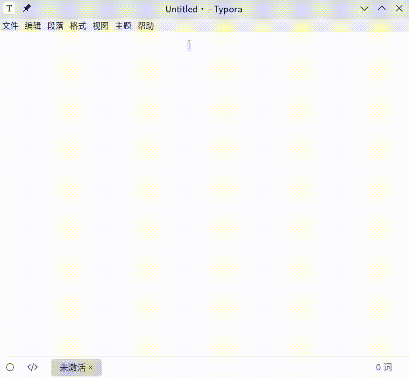

# InsertFormula

## 介绍

调用Mathpix API，实现Markdown中手写插入公式。

## 依赖软件

```shell
xournal++
```

## 使用说明

需提前在`run.sh`中配置好`APP_ID`和`APP_KEY`，然后在系统设置中设置快捷键启动`run.sh`即可。

启动`run.sh`后，会弹出xournal++的窗口，可在其中书写公式，书写完后，按下`Ctrl`+`S`,即可实现文件的保存，同时退出书写窗口，并且后台会自动调用Mathpix API，将Markdown公式写入剪切板中。只需在Markdown编辑器中粘贴公式即可。

## 效果


